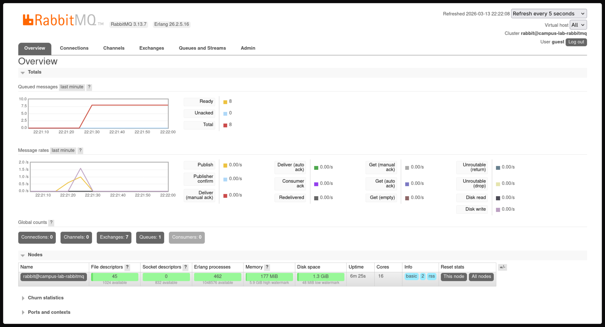
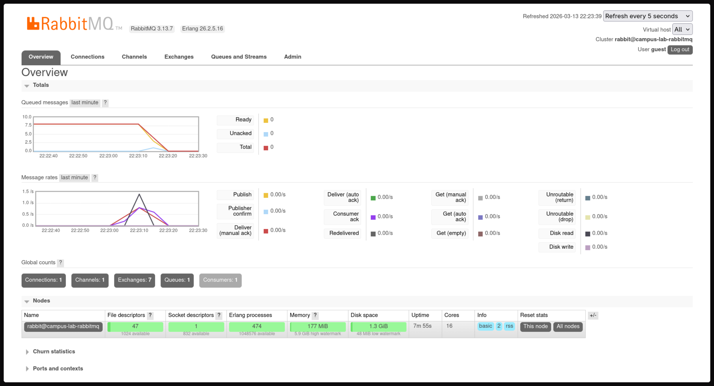

# Tugas A02 (Arsitektur Aplikasi Web)

## 1) Cara menjalankan

1. Jalankan semua service:

```bash
docker compose up --build -d
```


2. Kirim sampel event (Opsional)

```bash
bun run dev:producer
```


## 2) Demonstrasi event-flow (send → queue → consume)

1. Kirim event (via `bun run dev:producer` atau `POST http://localhost:3000/api/incidents` atau melalui UI (`http://localhost:5173`)).
2. RabbitMQ menyimpan event di queue `lab.incident.reported`.
3. Consumer membaca queue secara real-time dan memproses setiap message (mengklasifikasi + simpan ke database).

> Contoh: setelah `bun run dev:producer`, di dashboard RabbitMQ jumlah message naik; lalu apabila consumer hidup message turun karena diproses.


## 3) Pengujian & mekanisme asynchronous

### Pengujian

1. Matikan consumer:

```bash
docker compose kill campus-lab-consumer
```

2. Kirim event lagi:

```bash
bun run dev:producer
```

3. Lihat RabbitMQ dashboard: pesan akan menumpuk di queue.

4. Hidupkan kembali consumer:

```bash
docker compose start consumer
```

5. Pesan akan langsung dikonsumsi dan hasilnya tersimpan di Database.

### Visualisasi Pengujian

| Consumer mati (message ditahan) | Consumer hidup lagi (message dikonsumsi) |
|---|---|
|  |  |

- **Consumer mati**: Event dikirim → menumpuk di queue → tidak diproses sampai consumer hidup.
- **Consumer hidup lagi**: Queue diproses ulang → semua message yang tertahan dikonsumsi.


### Perbandingan antara mekanisme asynchronous dengan request–response

- **Asynchronous**: producer mengirim event ke queue lalu langsung selesai (`202 Accepted`).
- **Consumer** memproses event secara terpisah, jadi producer tidak perlu menunggu hasil.

Perbedaan dengan **request–response biasa**:

- **Request–response**:
  - Client mengirim request langsung ke server.
  - Server memproses request secara sinkron dan mengembalikan response.
  - Client harus menunggu response sebelum melanjutkan (blocking).
  - Contoh: POST /api/incidents → server klasifikasi langsung → return hasil.
  - Keuntungan: Sederhana, langsung, mudah debug.
  - Kerugian: Jika proses lama, client stuck; server harus handle semua beban sekaligus.

- **Event-driven (asynchronous)**:
  - Client publish event ke message queue (RabbitMQ).
  - Producer langsung selesai tanpa menunggu (non-blocking).
  - Consumer terpisah memproses event di background.
  - Contoh: Publish ke queue → consumer ambil dan proses nanti → hasil simpan ke DB.
  - Keuntungan: Scalable, decoupling, fault-tolerant (queue tahan jika consumer mati).
  - Kerugian: Lebih kompleks, sulit trace, eventual consistency.


---

**AI Declaration:**  
Implementasi kode, proses debugging, dan penyusunan dokumentasi README ini dibantu oleh AI (Google Gemini) untuk:  
- Meningkatkan efisiensi dalam pengembangan aplikasi.  
- Memastikan akurasi kode dan integrasi komponen seperti RabbitMQ dan Docker.  
- Memperbaiki struktur dan kejelasan penjelasan dalam dokumentasi.

